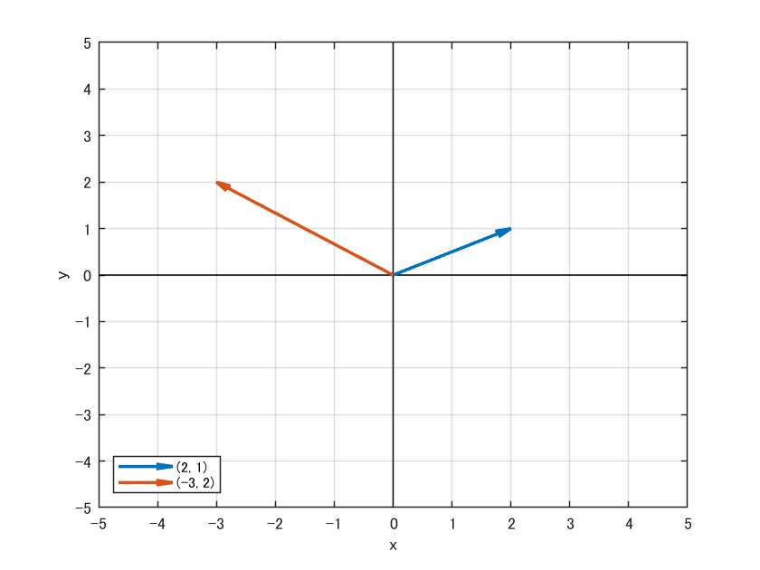
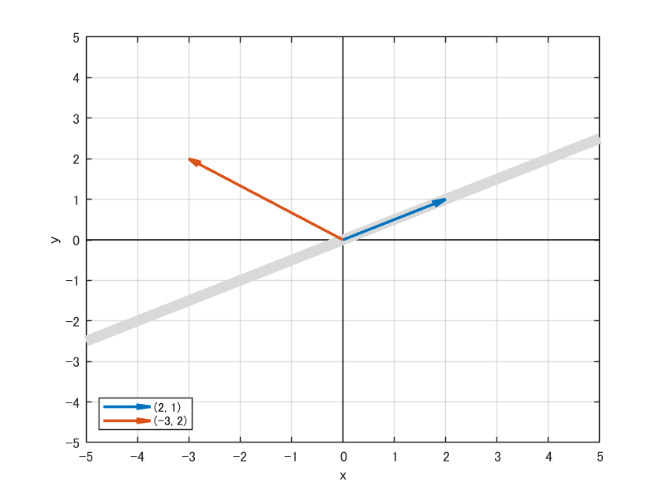
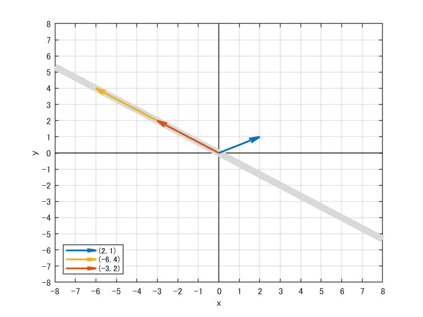
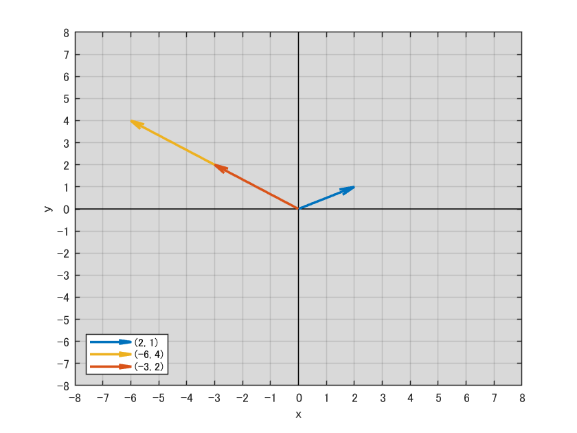
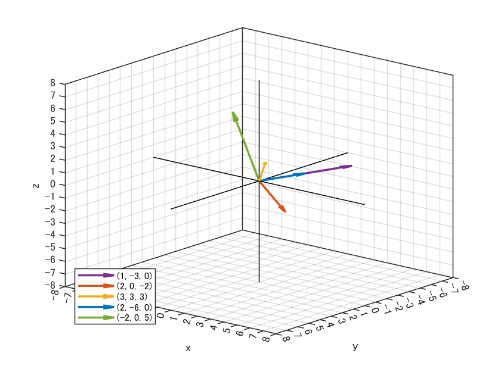
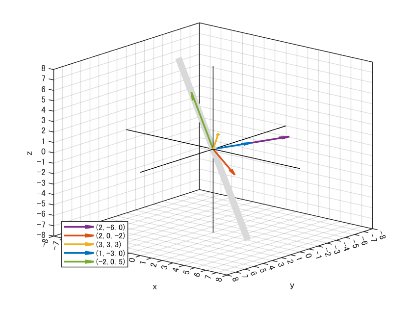
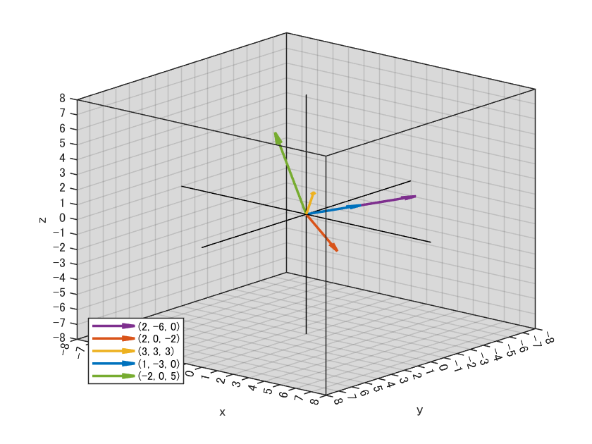

# **ベクトルと部分空間の可視化：plot2d関数＆plot3d関数**

***
# **機能概要**
2次元空間上と3次元空間上でベクトルを可視化します．
あるベクトルが生成する（張る）部分空間の可視化機能も付いています．
できるだけ見やすくなるように気を使っています．例えば下記
- x軸とy軸とz軸の直線を描画します
- 平行なベクトルは短いものを前面に描画することで，他のベクトルの背面に隠れないようにします
- 部分空間が1次元の場合，太めの直線を背面に描画します
- 部分空間が2次元の場合，半透明の平面を描画します

線形代数の講義なんかで役に立つかも知れません．

***
# **plot2d関数**
## **ベクトルの描画**
まずベクトルを次のように定義します．
```MATLAB:
u1 = [2, 1]';
u2 = [-3, 2]';
```
このとき，必ず転置（'）するか
```MATLAB:
u1 = [2; 1];
u2 = [-3; 2];
```
のように記述して，縦ベクトルとして作ってください．
あとは，次を実行することで描画できます．
```MATLAB:
plot2d([u1, u2]); % ベクトルを可視化
```
すると，下図が表示されます．



## **部分空間の可視化**
ベクトルと一緒に，あるベクトルが生成する部分空間を可視化できます．
例えば，u1の生成する部分空間を描画したいときは次のようになります．
```MATLAB:
u1 = [2, 1]';
u2 = [-3, 2]';
plot2d([u1, u2], 1); % u1の部分空間を可視化
```
下図が表示されます．灰色の直線上がu1の生成する部分空間です．



複数のベクトルが生成する部分空間も描画できます．
例えば，次のような感じです．
```MATLAB:
u1 = [2, 1]';
u2 = [-3, 2]';
u3 = 2*u2;
plot2d([u1, u2, u3], [2, 3]); % u2とu3が生成する部分空間を可視化
```
下図が表示されます．
灰色の直線上がu2とu3の生成する部分空間です．
u2とu3は平行なので，部分空間は1次元となります．



指定した複数のベクトルの1次独立な最大個数が2であれば，2次元空間を生成するため，下図のようになります．
```MATLAB:
u1 = [2, 1]';
u2 = [-3, 2]';
u3 = 2*u2;
plot2d([u1, u2, u3], [1, 2]); % u1とu2が生成する部分空間を可視化
```



***
# **plot3d関数**
## **ベクトルの描画**

使い方はplot2dの時と同じです．例えば，次のような感じです．
```MATLAB:
u1 = [1, -3, 0]';
u2 = [2, 0, -2]';
u3 = [3, 3, 3]';
u4 = 2*u1;
u5 = [-2, 0, 5]';
plot3d([u1, u2, u3, u4, u5]); % ベクトルを可視化
```

下図が表示されます．



特に3次元空間では，フィギュアの回転を使うと直感的に理解できます．


## **部分空間の可視化**
使い方はplot2dの時と同じです．例えば，1次元の部分空間は次のような感じです．

```MATLAB:
u1 = [1, -3, 0]';
u2 = [2, 0, -2]';
u3 = [3, 3, 3]';
u4 = 2*u1;
u5 = [-2, 0, 5]';
plot3d([u1, u2, u3, u4, u5], 5); % u5が生成する部分空間を可視化
```



2次元の部分空間は次のような感じです．

```MATLAB:
u1 = [1, -3, 0]';
u2 = [2, 0, -2]';
u3 = [3, 3, 3]';
u4 = 2*u1;
u5 = [-2, 0, 5]';
plot3d([u1, u2, u3, u4, u5], [1, 5]); % u1とu5が生成する部分空間を可視化
```


3次元の部分空間は次のような感じです．

```MATLAB:
u1 = [1, -3, 0]';
u2 = [2, 0, -2]';
u3 = [3, 3, 3]';
u4 = 2*u1;
u5 = [-2, 0, 5]';
plot3d([u1, u2, u3, u4, u5], [1, 2, 3]); % u1とu2とu3が生成する部分空間を可視化
```



